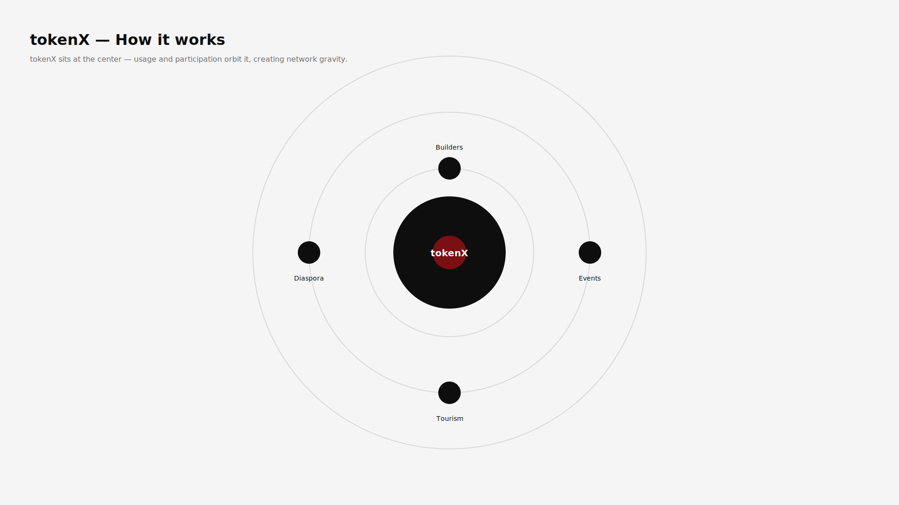
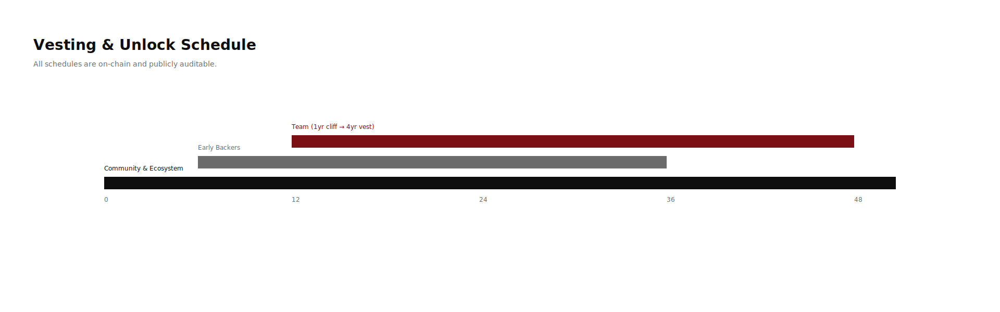

# tokenX — Tokenomics

**Participation-driven. Fixed supply. Market-discovered value.**

tokenX is a public crypto token and network rooted in the Caribbean, designed to coordinate participation, culture, and economic activity in an open and permissionless way.

tokenX does not promise returns. Value emerges from voluntary use.

---

## Overview

- **Blockchain:** Sui (v0), chain-agnostic by design  
- **Total Supply:** 10,000,000,000 tokenX (fixed)  
- **Inflation:** None  
- **Retail Participation:** Explicitly allowed  

tokenX is not a stablecoin, dividend, or revenue-sharing instrument.

---

## How tokenX Works (Mental Model)

tokenX sits at the center of the network.  
Usage, participation, and cultural activity orbit it, creating economic gravity.

> If this image does not render, see: `assets/tokenx_mental_model.svg`

---

## Supply Allocation

The total supply of tokenX is **fixed at 10 billion tokens**.

| Category | Percentage | Tokens |
|--------|------------|--------|
| Community & Ecosystem | 40% | 4,000,000,000 |
| Foundation Treasury | 20% | 2,000,000,000 |
| Contributors / Core Team | 15% | 1,500,000,000 |
| Early Backers | 10% | 1,000,000,000 |
| Public Launch Liquidity | 10% | 1,000,000,000 |
| Strategic Partners | 5% | 500,000,000 |
| **Total** | **100%** | **10,000,000,000** |

- Supply is fixed  
- No inflation or rebasing  
- Allocations and vesting are transparent and on-chain  

---

## Token Utility (v0)

tokenX is designed for **participation**, not promises.

Primary uses include:

- **Staking**
  - Signal commitment to the network
  - Register projects, events, and initiatives
- **Access**
  - Token-gated communities, tools, and experiences
- **Ecosystem Fees**
  - Certain protocol actions require tokenX
  - Fees may be burned or routed to ecosystem funds
- **Culture**
  - NFTs, events, creative programs, and regional expression

There is no guaranteed yield, dividend, or profit share.

---

## Flow of Participation & Value

tokenX does not distribute revenue directly to holders.

Instead, value emerges indirectly through network activity and usage.

**Conceptually:**

- Users, builders, and projects stake or spend tokenX to participate
- Protocol actions generate fees in tokenX
- Fees are:
  - partially burned, and/or
  - routed to ecosystem or foundation funds
- Token holders benefit indirectly from increased utility and demand

---

## Vesting & Unlock Schedule

All vesting schedules are **on-chain and publicly auditable**.

**Summary:**

- **Contributors / Core Team**
  - 1-year cliff
  - 4-year linear vest
- **Early Backers**
  - 6–12 month cliff
  - 2–3 year linear vest
- **Community & Ecosystem**
  - Gradual emissions via grants, participation, and programs
- **Public Liquidity**
  - Available early to support open markets
- **Foundation Treasury**
  - Long-term stewardship allocation

---

## Governance & Stewardship

tokenX is stewarded by the **tokenX Foundation**, which exists to:

- support ecosystem development
- fund public goods and grants
- maintain protocol infrastructure
- represent the network externally

The Foundation does **not**:
- manage token price
- promise returns
- intervene in markets

Governance is expected to evolve gradually.

---

## Risk Disclosure

Participation in tokenX involves risk, including:

- market volatility
- technical risk
- regulatory uncertainty
- social and cultural dynamics

Participation is voluntary.  
No guarantees are made.

---

## Closing

tokenX is an open invitation.

It does not ask for belief — only participation.

The market decides what it becomes.

---

*tokenX does not promise returns. Participation is at your own risk.*
